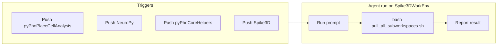

# Analyze and optimize subtree-update Cursor Cloud automation

## Current automation summary

The automation in [.cursor/automtations/automation_fetch_subtree_updates.md](.cursor/automtations/automation_fetch_subtree_updates.md) is a **JSON config** (stored in a `.md` file) that:

- **Triggers:** Fires on **push to branch** for four upstream repos (each with its own branch and `userAllowlist: ["CommanderPho"]`):
  - `CommanderPho/pyPhoPlaceCellAnalysis` → `develop`
  - `CommanderPho/NeuroPy` → `feature/safe-advance`
  - `CommanderPho/pyPhoCoreHelpers` → `release/pho-diba-2025-paper`
  - `CommanderPho/Spike3D` → `master`
- **Target repo:** `gitConfig` points to `CommanderPho/Spike3DWorkEnv` on branch `codespace-commanderpho-redesigned-capybara-q7vpp6gjgj39vp7`.
- **Action:** Single prompt instructing the agent to run the subtree update script.
- **Settings:** Model `claude-4.6-sonnet-high-thinking`, `memoryEnabled: true`, `scope: "private"`, `actions: []`.

The script it runs is the hardened [SCRIPTS/pull_all_subworkspaces.sh](SCRIPTS/pull_all_subworkspaces.sh): ensures remotes, fetches, then runs four `git subtree pull --squash` with continue-and-report (see [.cursor/plans/harden_pull_all_subworkspaces.sh_f7a0d08d.plan.md](.cursor/plans/harden_pull_all_subworkspaces.sh_f7a0d08d.plan.md)).

---

## Findings and optimizations

### 1. Prompt and path

**Issue:** The prompt says `SCRIPTS\\pull_all_subworkspaces.sh`. Cloud Agent environments are typically Linux; backslashes are Windows-specific and can confuse the agent. The script is bash; the agent must run it with a shell that can execute it (e.g. `bash SCRIPTS/pull_all_subworkspaces.sh`).

**Optimization:**

- Use a **cross-platform path** in the prompt: `SCRIPTS/pull_all_subworkspaces.sh`.
- Make the prompt **explicit** so the agent does the right thing every time:
  - Run from **repo root** (script already `cd`s there, but stating it avoids mistakes).
  - Invoke via **bash**: e.g. `bash SCRIPTS/pull_all_subworkspaces.sh`.
  - Clarify **expected outcome**: script is non-interactive; report success or list failed subtrees if any; **do not push** (script does not push; stating it avoids the agent pushing afterward).

**Suggested prompt text:**

```text
From the repository root, run: bash SCRIPTS/pull_all_subworkspaces.sh
This fetches and merges the four subtree repos (NeuroPy, pyPhoCoreHelpers, pyPhoPlaceCellAnalysis, Spike3D) into this repo. Do not push. Report whether all pulls completed or list any failed subtrees.
```

---

### 2. Model choice

**Issue:** `claude-4.6-sonnet-high-thinking` is a high-capability model. The task is “run one script and report result,” which does not need deep reasoning.

**Optimization:** Consider a **lighter/faster model** (e.g. a non–high-thinking Sonnet or a faster tier) to reduce cost and latency. Keep the high-thinking model only if you want the agent to interpret failures and suggest fixes.

---

### 3. Memory

**Issue:** `memoryEnabled: true` persists notes across runs. For a repetitive “run script on push” task, memory rarely adds value and can accumulate noise or incorrect context.

**Optimization:** Set `**memoryEnabled: false`** unless you plan to add follow-up instructions that benefit from memory (e.g. “remember which subtree failed last time”).

---

### 4. Trigger structure

**Issue:** Each trigger has both `repo` and `repos: [ same repo ]`. This may be required by Cursor’s export format; if the UI or API accepts a single `repo` per “Push to branch” trigger, you can try removing the redundant `repos` array after confirming in the Cursor automations UI or docs.

**Optimization:** If the schema allows, keep one of `repo` or `repos` per trigger to avoid confusion. If not, leave as-is and add a short comment in the file (see below).

---

### 5. gitConfig branch

**Issue:** `branch` is set to `codespace-commanderpho-redesigned-capybara-q7vpp6gjgj39vp7`, which looks like a **codespace-specific branch**. If the automation is meant to run in a long-lived environment, this may need to be updated when the codespace or branch changes (e.g. to a stable branch like `main` or a dedicated `automation/subtree-sync`).

**Optimization:** Decide whether the automation should target:

- A **stable branch** (e.g. `main` / `master`) so runs are predictable, or  
- The **current codespace branch** and document that this value must be updated when the codespace branch changes.

---

### 6. Documentation and file format

**Issue:** The file is named `.md` but is effectively a JSON blob with no human-readable description, so intent and maintenance are unclear.

**Optimization:**

- Add a **short markdown header** above the JSON describing: purpose (sync subtrees on push to any of the four repos), how it works (runs `pull_all_subworkspaces.sh`), and where the script lives. This keeps the JSON intact for import/export.
- Optionally add a one-line comment in the JSON (if your tooling allows) or a separate line like `// Cursor Cloud Automation – do not edit triggers/gitConfig without updating this file.`

---

### 7. Optional: PowerShell path on Windows

The repo has [SCRIPTS/pull_all_subworkspaces.ps1](SCRIPTS/pull_all_subworkspaces.ps1), but it does **not** include the remote ensure-and-fetch logic that the bash script has. Cloud Agents usually run in a Linux environment, so **keeping the bash script as the single source of truth** for this automation is appropriate. If you later run the same automation from a Windows host, either use Git Bash/WSL for the `.sh` script or harden the `.ps1` to match the bash behavior (as in the plan’s “PowerShell parity” section) and then document when to use which.

---

## Summary of recommended changes


| Area          | Change                                                                                                                                               |
| ------------- | ---------------------------------------------------------------------------------------------------------------------------------------------------- |
| **Prompt**    | Use path `SCRIPTS/pull_all_subworkspaces.sh`; instruct to run with `bash` from repo root; say “do not push” and “report success or failed subtrees.” |
| **Model**     | Consider a lighter model unless you want the agent to reason about failures.                                                                         |
| **Memory**    | Set `memoryEnabled: false` unless you need cross-run memory.                                                                                         |
| **Triggers**  | Remove redundant `repos` if schema allows; otherwise leave as-is.                                                                                    |
| **gitConfig** | Align branch with intent (stable branch vs codespace branch) and document.                                                                           |
| **File**      | Add a short markdown description above the JSON.                                                                                                     |


---

## Flow (unchanged conceptually)




No code or script changes are required for the automation itself beyond the JSON and optional header in [.cursor/automtations/automation_fetch_subtree_updates.md](.cursor/automtations/automation_fetch_subtree_updates.md); the bash script is already suitable for autonomous use.