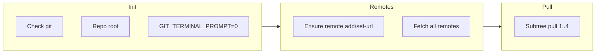

# Harden pull_all_subworkspaces.sh for remotes and autonomous runs

## Current behavior

- [SCRIPTS/pull_all_subworkspaces.sh](SCRIPTS/pull_all_subworkspaces.sh) runs four `git subtree pull --squash` commands (with `set -e`).
- It assumes remotes `remote-NeuroPy`, `remote-pyPhoCoreHelpers`, `remote-pyPhoPlaceCellAnalysis`, `remote-Spike3D` already exist and does not fetch before pulling.

## Goals

1. **Ensure remotes are configured and up-to-date before updating**
  - If a remote is missing, add it with the canonical URL.
  - If a remote exists, optionally ensure its URL matches the canonical URL (so an agent or fresh clone gets correct remotes).
  - Run `git fetch <remote>` (or `git remote update`) for all subtree remotes before any `git subtree pull`, so refs are current.
2. **Robust for autonomous Cursor Cloud Agent**
  - Run from anywhere: resolve repo root with `git rev-parse --show-toplevel` and `cd` there; if not in a git repo, exit with a clear message and non-zero exit.
  - Non-interactive: set `GIT_TERMINAL_PROMPT=0` (and optionally `GIT_SSH_COMMAND` or similar only if needed) so git does not block on prompts.
  - Dependencies: check that `git` is available; exit with a clear message if not.
  - Clear outcome: on success exit 0; on failure exit 1 and print which step failed so the agent can interpret the result.
  - Optional: continue on per-subtree failure and report all failures at the end (recommended for autonomy so one bad subtree does not block the others).

## Canonical remote configuration

Use a single source of truth in the script (aligned with [SCRIPTS/git_convert_to_subtrees.ps1](SCRIPTS/git_convert_to_subtrees.ps1)):

| Remote name                   | URL                                                                                                                      | Branch                      |
| ----------------------------- | ------------------------------------------------------------------------------------------------------------------------ | --------------------------- |
| remote-NeuroPy                | [https://github.com/CommanderPho/NeuroPy.git](https://github.com/CommanderPho/NeuroPy.git)                               | feature/safe-advance        |
| remote-pyPhoCoreHelpers       | [https://github.com/CommanderPho/pyPhoCoreHelpers.git](https://github.com/CommanderPho/pyPhoCoreHelpers.git)             | release/pho-diba-2025-paper |
| remote-pyPhoPlaceCellAnalysis | [https://github.com/CommanderPho/pyPhoPlaceCellAnalysis.git](https://github.com/CommanderPho/pyPhoPlaceCellAnalysis.git) | develop                     |
| remote-Spike3D                | [https://github.com/CommanderPho/Spike3D.git](https://github.com/CommanderPho/Spike3D.git)                               | master                      |

LFS skip-smudge: `pyPhoCoreHelpers`, `pyPhoPlaceCellAnalysis` (unchanged).

## Implementation outline

1. **Preamble (robustness)**
  - Shebang and `set -e`; optionally `set -u` for unbound variable detection.
  - Check `git` is in PATH; exit 1 with message if not.
  - Resolve repo root: `ROOT=$(git rev-parse --show-toplevel 2>/dev/null)`; if empty, print "Not inside a git repository" and exit 1; `cd "$ROOT"`.
  - Export `GIT_TERMINAL_PROMPT=0` so git does not prompt for credentials in terminal (credential helpers still work).
2. **Remote ensure-and-fetch phase**
  - Define four entries (remote name, URL, branch; and for two of them, LFS_SKIP_SMUDGE).
  - For each entry:
    - If remote does not exist: `git remote add <name> <url>`.
    - If remote exists and URL differs from canonical: `git remote set-url <name> <url>` (optional but recommended so remotes are always correct).
    - Run `git fetch <name>` (or after the loop, a single `git fetch` for all four remotes).
  - If any step in this phase fails, exit 1 with a clear message (e.g. "Failed to add/fetch remote-NeuroPy").
3. **Subtree pull phase**
  - **Option A (fail-fast, current behavior):** Run the four `git subtree pull ... --squash` commands in order; first failure stops the script and exits 1 with message indicating which subtree failed.
  - **Option B (continue-and-report, recommended for autonomy):** For each subtree, run the pull in a subshell or with a trap; on failure, record the subtree name and continue. At the end, if any failed, print "Failed subtrees: ..." and exit 1; else exit 0. This way one broken subtree does not block the others and the agent gets a full picture.
4. **Output and exit**
  - Print brief progress (e.g. "Ensuring remotes...", "Pulling subtree NeuroPy...", etc.) so the agent log is readable.
  - On success: print "All subtree pulls completed." and exit 0.
  - On failure: print which step failed and exit 1.

## Suggested script structure (pseudo-code)

- Data structure: use a simple list of lines (e.g. `remote_name|url|branch|lfs_skip`) or four parallel arrays/sections; keep the script portable (bash-only is fine per shebang).
- No new external tools; only `git` and shell built-ins.

## Files to change

- **[SCRIPTS/pull_all_subworkspaces.sh](SCRIPTS/pull_all_subworkspaces.sh)**  
  - Add preamble (git check, repo root, `GIT_TERMINAL_PROMPT=0`).  
  - Add remote ensure-and-fetch block using canonical URLs/branches.  
  - Keep or replace the four subtree pull commands with the same options; wrap in per-subtree failure handling if Option B is chosen.  
  - Add clear success/failure messages and exit codes.  
  - Preserve LFS behavior for pyPhoCoreHelpers and pyPhoPlaceCellAnalysis.

## Optional

- **PowerShell parity:** Apply the same remote-ensure-and-fetch and robustness ideas to [SCRIPTS/pull_all_subworkspaces.ps1](SCRIPTS/pull_all_subworkspaces.ps1) in a follow-up so both scripts behave consistently.
- **README:** The README already says to run the script from repo root; after this change the script will work from any subdirectory; you can optionally add a note like "Can be run from any subdirectory; script changes to repo root automatically."

## Design choice to confirm

- **Failure mode:** Prefer **Option B (continue-and-report)** so that if one subtree fails (e.g. network to one repo, or branch renamed), the agent still updates the others and gets an explicit list of failed subtrees. If you prefer strict fail-fast (Option A), the plan can keep current behavior and only add remote ensure + fetch + repo-root and non-interactive settings.

